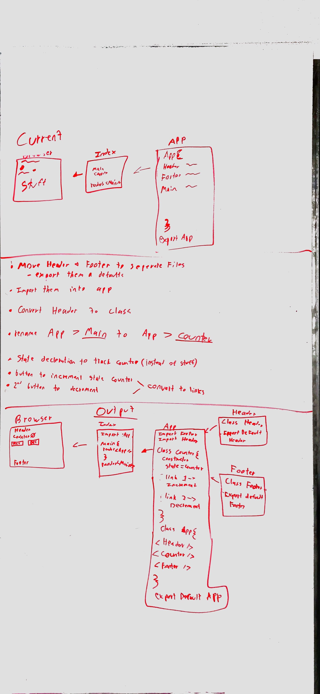

 LAB
=================================================

## Lab26 

### Author: Spencer Hirata

### Links and Resources
* [repo](http://xyz.com)

### Components
Header, Footer, Counter

#### Running the app
* Fork this code sandbox at the top of this repo
* Install dotenv, react, react-redux, react-dom, redux
* Should work from there
  
#### UML

